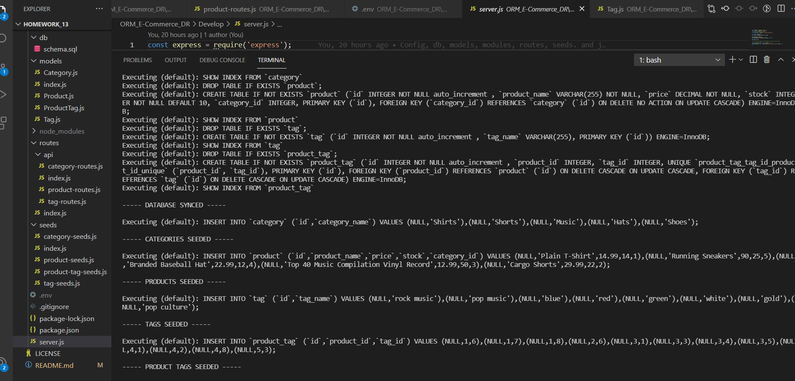
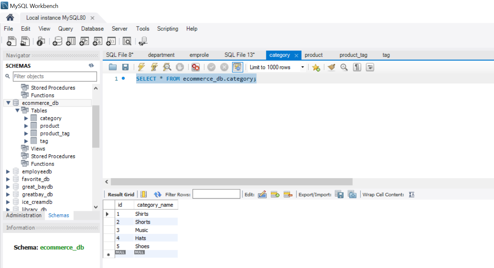
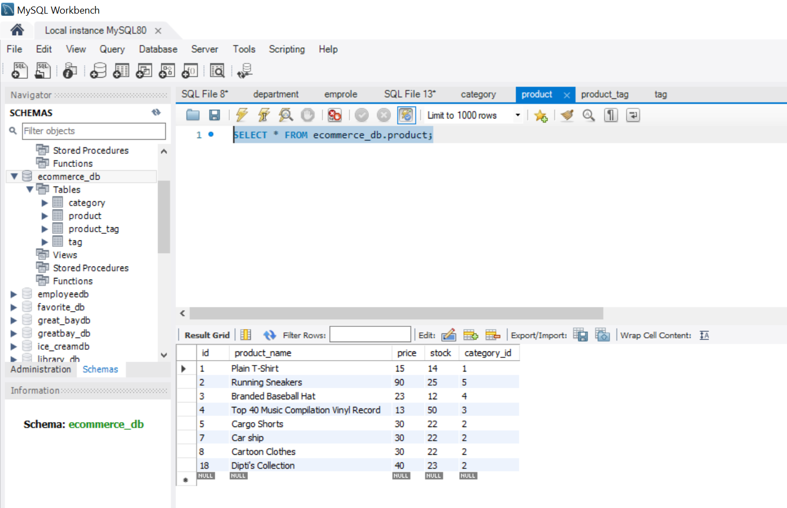
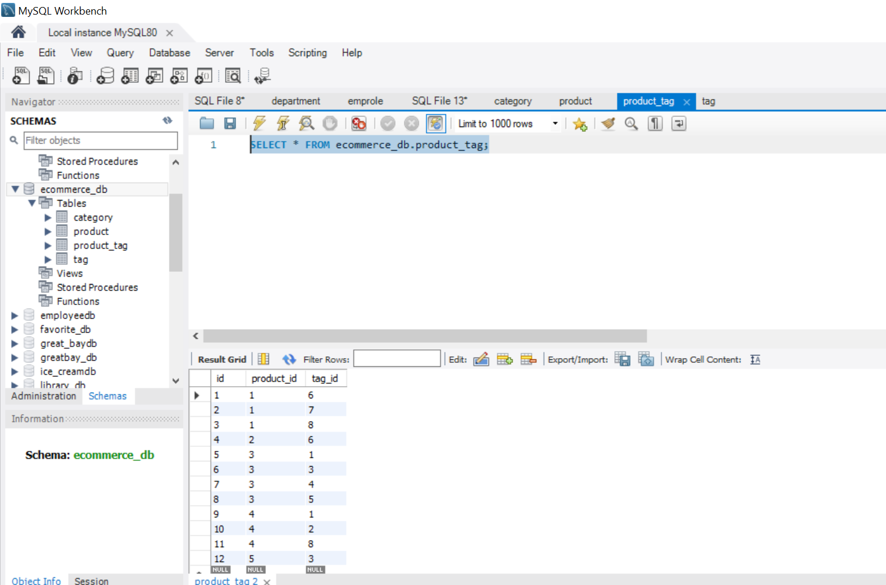
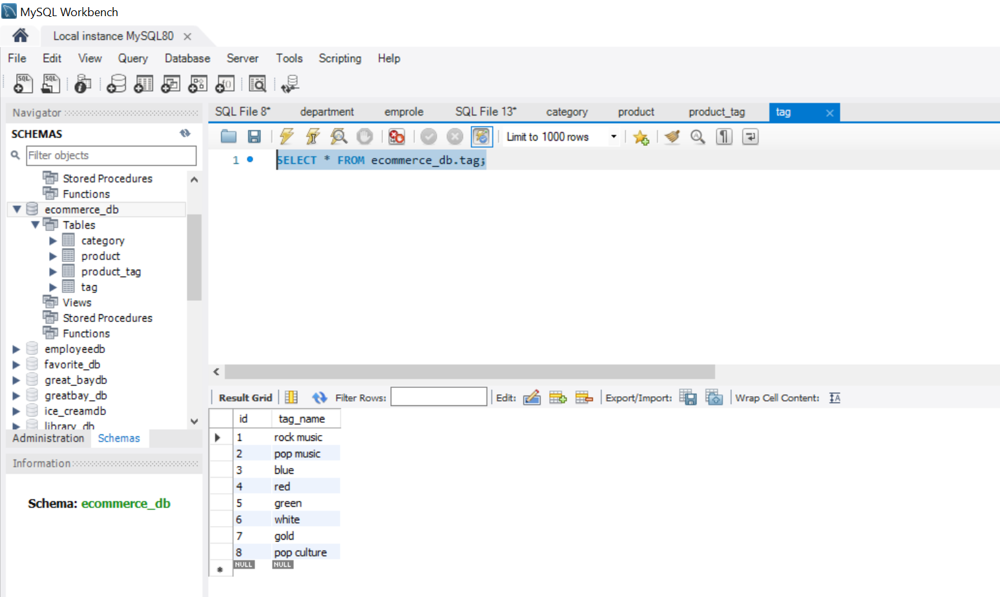
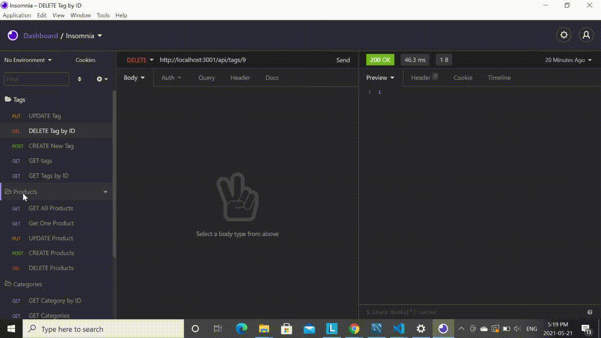
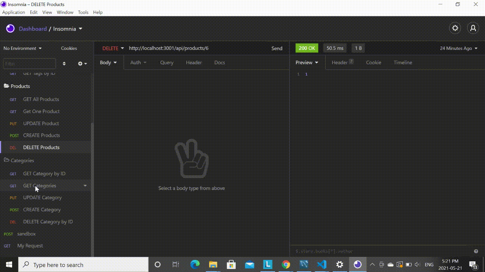

# ORM_E-Commerce_DR


Back end for an e-commerce website that uses the latest technologies so that the company can compete with other e-commerce companies
## Table of Contents
* [Introduction](#introduction)
* [Screenshot of the DB](#db)
* [Demo of the Application](#demo)
* [Deployed Application](#web)
* [Deployment](#installations)
* [Questions](#ques)

 ## Introduction 
I have created the backend of an E-Commerce website. MySQL is used as the database and Sequelize packages are used to connect the Express.js API to the database. The SQL database includes tables for products, categories, tags, and product tags. Also, the RESTful API routes are used to make requests and updates from the database. Being a back end Code, I have used __Insomnia__ as the API design platform. All the outputs can been tested via the same design.
 In order to run the code, following stepls need to be taken 
  Navigate to the root directory and run 
  ```
npm install
```

 ```
npm install mysql2
```

 ```
npm install express
```

 ```
npm install dotenv

```
  On installing all the necessary libraries, seed the files provide to the My SQL database using the command
   ```
npm run seed

```
Finally ,run the 
   ```
node server 

```
command to run the app

 ## Screenshot of the DB
 
 __Here are some screenshots taken from the terminal and the ecommerce database created on MySql workbench__
 
  * __Seeding__
  
 
 
 
  * __Categories__
  
  
  
 
   * __Products__
   
  
  
  
   * __Product Tags__
   
  
  
  
  * __Tags__
  
  
  
 
 ## Demo of the App
 A demo of this app has been divided into 3 parts. Each gif shows the _CREATE, UPDATE, GET & DELETE_ outputs for the _products, tags and categories_ created.
 
 1. __CREATE, UPDATE, GET & DELETE - Products__
 
 
 
 2. __CREATE, UPDATE, GET & DELETE - Tags__
 
 
 
  3. __CREATE, UPDATE, GET & DELETE - Categories__
  
 
 
 You can also view the same code as a video by clicking on [this Youtube link](https://www.youtube.com/watch?v=AwkMgw_AwpU)

 

 
 ## Deployment
 Attached is the Github repo for the code
   * [The URL of the Github repo](https://github.com/Dipti2021/ORM_E-Commerce_DR)
   

 ## Questions
In case of any questions, contact me through any of the following methods:
 * If you want you can [open an issue](https://github.com/Dipti2021/ORM_E-Commerce_DR/issues) and let me know about it.


    
